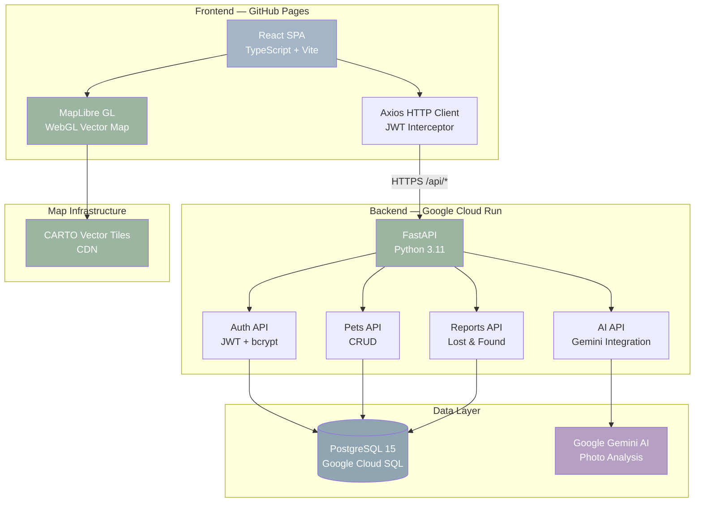
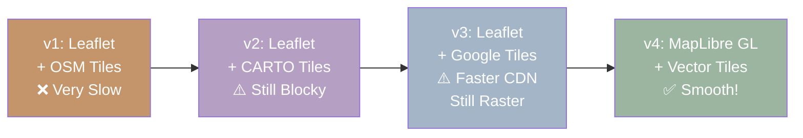
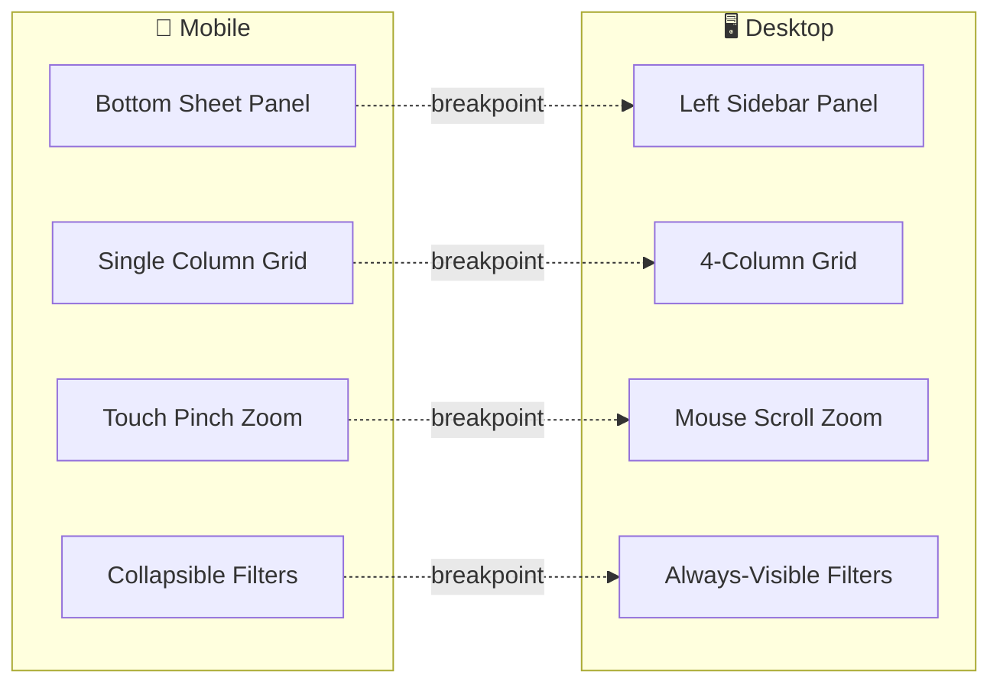
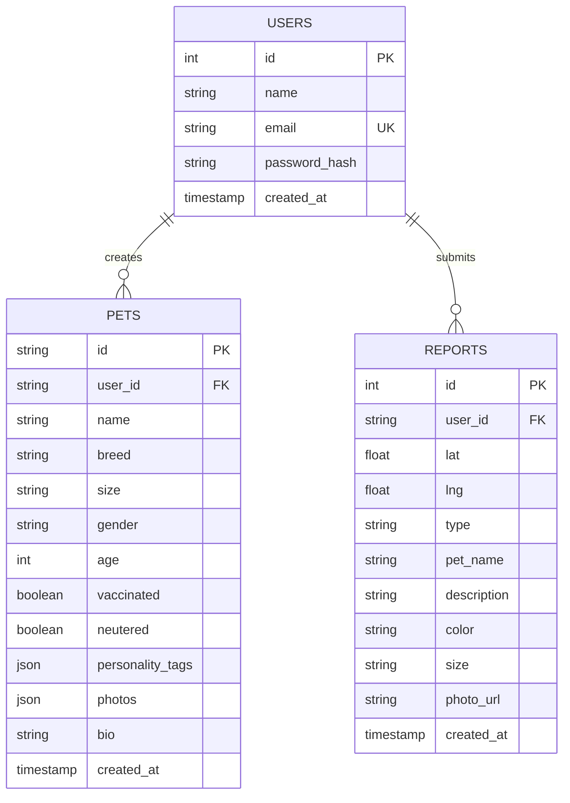

<p align="center">
  
</p>

<p align="center">
  
</p>

<p align="center">
  <b>The all-in-one platform for pet lovers.</b>
</p>

<p align="center">
  <a href="https://xungirl.github.io/neu_hackathon/"></a>
  &nbsp;&nbsp;&nbsp;&nbsp;&nbsp;&nbsp;
  <a href="https://goodle-backend-779591146096.us-central1.run.app"></a>
</p>

<p align="center">
  
  
  
  
  
  
  
  
</p>

---

## 💡 Inspiration

> *"Everyone Googles for information — but who Goodles for love?"*

Every year, **6.3 million** pets enter shelters in the US alone. Countless others go missing and never find their way home.

The idea for Goodle was inspired by **Kimberlyn**, whose passion for animal welfare showed us that technology can bridge the gap between pets in need and the people who love them. We built a Tinder-meets-Petfinder experience powered by AI — upload a photo, and Gemini tells you the breed, age, and personality in seconds. Swipe to match. Post to adopt. Pin on the map to reunite.

**Good** + **Doodle** = **Goodle** — because every pet deserves a good life. 🐕

---

## ✨ Features

> **💘 Pet Matching** — Swipe cards with distance, gender & personality filters across Seattle
>
> **🏠 Adoption Square** — Search by breed & age, rich detail pages with health & activity info
>
> **🗺️ Lost & Found** — WebGL vector map, GPS reports with photo upload, persistent in PostgreSQL
>
> **🤖 AI Analysis** — Gemini detects breed, age, size & personality from a single photo
>
> **🔐 Auth** — JWT email/password, required for reports &nbsp;&bull;&nbsp; **📧 Contact** — Pre-filled mailto &nbsp;&bull;&nbsp; **📱 Responsive** — Mobile-first on all pages

---

## 🏗 System Architecture



---

## 🗺️ Map Evolution — From Slow to Smooth

Building a fast interactive map was one of our biggest technical challenges.

### The Problem

Our initial implementation used **Leaflet + raster PNG tiles**. Every zoom or pan triggered dozens of 256×256 pixel image downloads — visible "block-by-block" loading with 3-5 second initial load times.

### Our Journey



### Raster vs Vector — Why We Switched

> ❌ **Raster** (PNG tiles): 15-25 KB each, CPU rendered, block-by-block loading
>
> ✅ **Vector** (PBF tiles): 2-5 KB each, WebGL GPU rendered, 60fps smooth zoom

### 9 Optimizations Across 4 Versions

> `lazy loading` → `preconnect` → `4× parallel CDN` → `canvas GPU` → `idle updates` → `icon cache` → `no animations` → **`vector tiles`** → `skeleton UI`

**Final stack:** MapLibre GL JS &bull; CARTO Voyager vectors &bull; WebGL &bull; Protocol Buffers

---

## 🛠 Tech Stack

<p align="center">
  
  
  
  
  
  
  
</p>

<p align="center">
  
  
  
  
  
  
</p>

### ☁️ Infrastructure

<p align="center">
  
  
  
  
  
  
</p>

---

## 📱 Responsive Design



| Page | Mobile | Desktop |
|---|---|---|
| **Home** | Stacked hero + cards | Side-by-side layout |
| **Matching** | Full-width card | 3-column: filters / card / info |
| **Lost & Found** | Bottom drawer (60vh), touch zoom | Left sidebar, scroll zoom |
| **Adoption** | 1-col grid, stacked filters | 4-col grid, inline filter bar |
| **Pet Details** | Stacked image + info | 2-column gallery + details |

---

## 🗄️ Database Schema



---

## 📂 Project Structure

```
goodle/
├── 🐍 app/                        # Backend (FastAPI)
│   ├── ai/                        #   Gemini AI clients
│   ├── api/                       #   AI route handlers
│   ├── core/                      #   Auth, settings, deps
│   ├── db/                        #   Database (SQLite / PostgreSQL)
│   ├── routes/                    #   auth.py, pets.py, reports.py
│   └── main.py                    #   App entry + table init
├── ⚛️ src/                         # Frontend (React + TS)
│   ├── api/services/              #   auth, pets, reports, ai
│   ├── assets/pets/               #   12 local pet images
│   ├── components/                #   Navbar, Footer, AI matchers
│   ├── context/                   #   Auth context + hook
│   ├── pages/                     #   8 page components
│   ├── services/                  #   Mock data (18 pets, 6 markers)
│   └── types/                     #   TypeScript interfaces
├── .github/workflows/             #   CI/CD pipeline
├── Dockerfile                     #   Python 3.11-slim container
├── vite.config.ts                 #   Build config
└── requirements.txt               #   Python deps
```

---

## 🚀 Getting Started

### Prerequisites
> Node.js 20+ &bull; Python 3.11+ &bull; PostgreSQL *(optional)*

```bash
# Frontend
npm install && npm run dev       # → http://localhost:5173

# Backend
pip install -r requirements.txt -r requirements-backend.txt
uvicorn app.main:app --reload --port 8001
```

### 🔑 Environment Variables
| Variable | Description | When |
|---|---|---|
| `DATABASE_URL` | PostgreSQL connection string | Production |
| `JWT_SECRET` | JWT signing secret | Always |
| `GEMINI_API_KEY` | Google Gemini API key | AI features |
| `AI_MOCK_MODE` | `1` = mock AI responses | Dev only |

---

## 👥 Team & Acknowledgements

Built with ❤️ at **Seattle Hackathon 2026** — fueled by late-night coffee, pixel-perfect dreams, and the wagging tails that kept us going.

This project exists because of **[Kimberlyn](https://www.linkedin.com/in/manqiu-yang-3b6a46311)** — the kind of person who stops for every stray, remembers every shelter dog's name, and believes no pet should ever feel unloved. Her heart for animals became our north star. This one's for you, K.

We didn't just build an app. We built a love letter to every pet still waiting by the window for someone to come home. 🐾

---

<p align="center">
  
</p>

<p align="center">
  <sub>Made with 🧡 by the Goodle team &bull; Seattle Hackathon 2026</sub>
</p>
