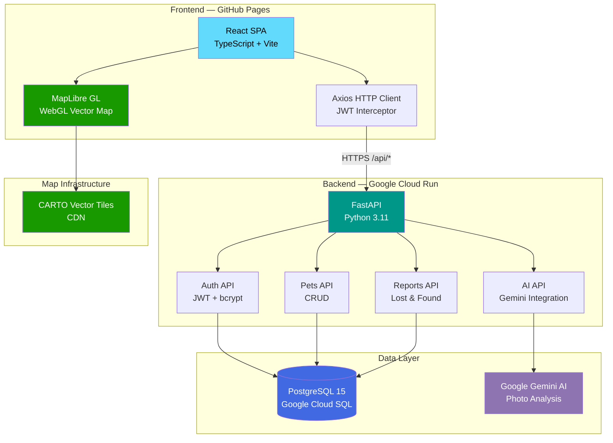
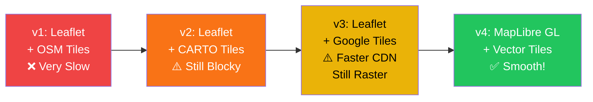
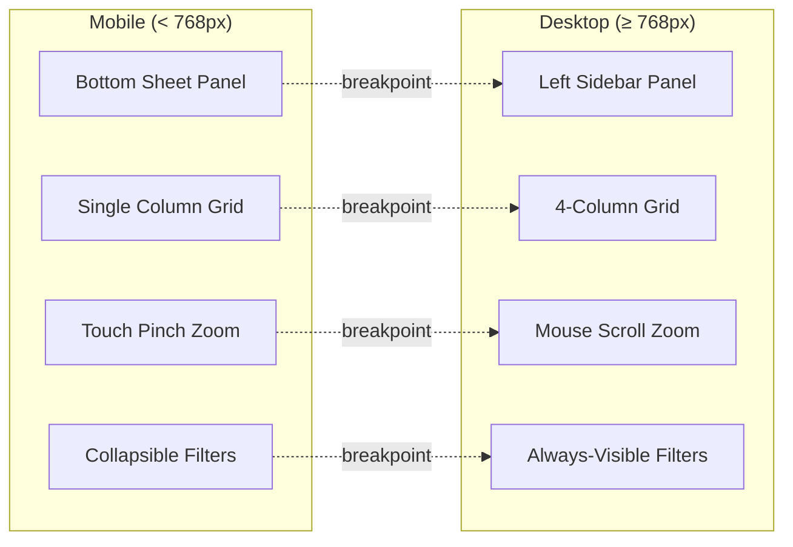
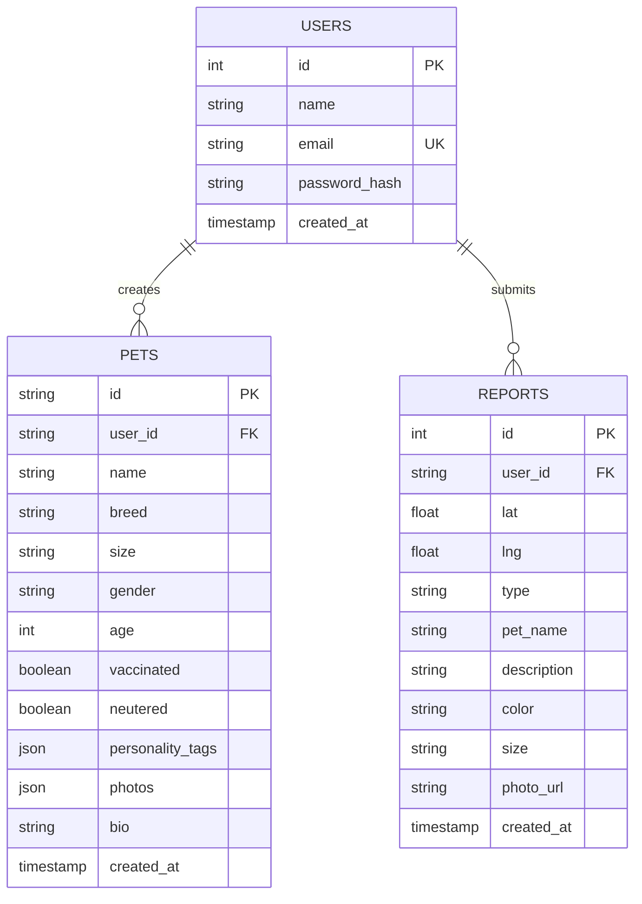

<p align="center">
  
</p>

<h1 align="center">Goodle</h1>

<p align="center">
  
</p>

<p align="center">
  <b>The all-in-one platform for pet lovers.</b><br/>
  Match. Report. Adopt. Reunite. — All powered by AI.
</p>

<p align="center">
  <a href="https://xungirl.github.io/neu_hackathon/"></a>
  &nbsp;
  <a href="https://goodle-backend-779591146096.us-central1.run.app"></a>
</p>

<p align="center">
  
  
  
  
  
  
  
  
</p>

---

## 💡 Inspiration

> *"Everyone Googles for information — but who Goodles for love?"*

Every year, **6.3 million** pets enter shelters in the US alone. Countless others go missing and never find their way home. We saw a gap: there was no single platform that combined **adoption**, **lost & found**, and **social matching** for pets.

So we built **Goodle** — a Tinder-meets-Petfinder experience powered by AI. Upload a photo, and our Gemini AI tells you the breed, age, and personality in seconds. Swipe to match. Post to adopt. Pin on the map to reunite.

**Good** + **Doodle** = **Goodle** — because every pet deserves a good life. 🐕

---

## ✨ Features

<table>
<tr>
<td align="center" width="25%">
  <h3>💘</h3>
  <b>Pet Matching</b><br/>
  <sub>Swipe cards with real-time filters — distance, gender, personality. 18+ profiles across Seattle.</sub>
</td>
<td align="center" width="25%">
  <h3>🏠</h3>
  <b>Adoption Square</b><br/>
  <sub>Search, filter by breed & age. Rich detail pages with health info, activity levels, and owner contact.</sub>
</td>
<td align="center" width="25%">
  <h3>🗺️</h3>
  <b>Lost & Found Map</b><br/>
  <sub>Vector map with GPS reports, photo upload, color/size tags. Persistent in PostgreSQL database.</sub>
</td>
<td align="center" width="25%">
  <h3>🤖</h3>
  <b>AI Photo Analysis</b><br/>
  <sub>Gemini AI detects breed, age, size, color, and personality from a single photo.</sub>
</td>
</tr>
</table>

| | Feature | Details |
|---|---|---|
| 💘 | **Pet Matching** | Swipe cards, distance slider (1–100 mi), gender toggle, personality multi-select |
| 🏠 | **Adoption Square** | Keyword search, breed dropdown, age filter, detail pages with activity/sociability bars |
| 🗺️ | **Lost & Found** | Vector map (MapLibre GL), GPS reports, photo upload, color/size, email contact |
| 🤖 | **AI Analysis** | Gemini AI breed detection, age estimation, personality guess from photo |
| 🔐 | **Auth** | Email/password JWT auth, required for report submission |
| 📧 | **Contact** | Pre-filled mailto links for instant reporter communication |
| 📱 | **Responsive** | Mobile bottom-sheet, touch zoom, adaptive grids on every page |

---

## 🏗 System Architecture



---

## 🗺️ Map Evolution — From Slow to Smooth

Building a fast interactive map was one of our biggest technical challenges. Here's the journey:

### The Problem

Our initial implementation used **Leaflet + raster PNG tiles**. Every zoom or pan triggered dozens of 256×256 pixel image downloads. The result: visible "block-by-block" loading and 3-5 second initial load times.

### What We Tried



### Why Vector Tiles Win

```
                    Raster (PNG)          Vector (PBF)
    ┌──────────────┬──────────────────┬──────────────────┐
    │ Tile Size    │  15-25 KB each   │  2-5 KB each     │
    │ Zoom         │  Reload new PNGs │  GPU re-renders   │
    │ Rendering    │  CPU (DOM/Canvas)│  WebGL (GPU)      │
    │ Smoothness   │  Block-by-block  │  Silky smooth     │
    │ Rotation     │  Not supported   │  Full 3D support  │
    │ Labels       │  Baked in image  │  Dynamic/crisp    │
    └──────────────┴──────────────────┴──────────────────┘
```

### All Optimizations Applied

| # | Optimization | Impact | Stage |
|---|---|---|---|
| 1 | `React.lazy()` map component | Map JS only loads when page visited | v1 |
| 2 | `preconnect` to tile CDN in HTML `<head>` | Saves ~200ms DNS+TLS handshake | v1 |
| 3 | Multiple tile subdomains (`mt0-mt3`) | 4× parallel downloads | v3 |
| 4 | `preferCanvas={true}` | GPU-accelerated marker rendering | v2 |
| 5 | `updateWhenIdle` / `updateWhenZooming=false` | No tile fetch during interaction | v2 |
| 6 | Marker icon caching (memory `Map`) | No DOM recreation for same icons | v2 |
| 7 | Remove CSS ping animations | Eliminates constant GPU repaints | v2 |
| 8 | **Switch to MapLibre GL + vector tiles** | **5-10× smaller data, WebGL smooth** | **v4** |
| 9 | Loading skeleton with spinner | No white screen during init | v1 |

### Final Stack

| Component | Technology | Why |
|---|---|---|
| **Map Engine** | MapLibre GL JS | Free, WebGL, vector rendering |
| **Tile Source** | CARTO Voyager (vector) | Beautiful style, fast CDN, free |
| **Tile Format** | Protocol Buffers (.pbf) | 5× smaller than PNG tiles |
| **Rendering** | WebGL (GPU) | 60fps zoom/pan, no block artifacts |
| **Markers** | Custom HTML elements | Circular pet photos with colored borders |
| **Popups** | MapLibre native popups | Photo, description, mailto contact |

---

## 🛠 Tech Stack

<table>
<tr>
<td width="50%" valign="top">

### 🎨 Frontend
| | Tech | Role |
|---|---|---|
| ⚛️ | **React 18** + **TypeScript** | UI framework |
| ⚡ | **Vite** | Build tool (code-split, tree-shake) |
| 🎨 | **Tailwind CSS** | Utility-first responsive styling |
| 🗺️ | **MapLibre GL JS** | Vector map (WebGL) |
| 🧭 | **React Router** (HashRouter) | SPA routing |
| 🎯 | **Lucide React** | Icons (tree-shakeable) |
| 🌐 | **Axios** | HTTP client with JWT interceptor |

</td>
<td width="50%" valign="top">

### ⚙️ Backend
| | Tech | Role |
|---|---|---|
| 🐍 | **FastAPI** (Python 3.11) | Async API framework |
| 🐘 | **PostgreSQL 15** | Database (users, pets, reports) |
| 🤖 | **Google Gemini AI** | Photo/video analysis |
| 🔑 | **python-jose** + **bcrypt** | JWT auth + password hashing |
| 📋 | **Pydantic** | Request/response validation |
| 🔌 | **psycopg2** | PostgreSQL adapter |

</td>
</tr>
</table>

### ☁️ Infrastructure
| | Service | Role |
|---|---|---|
| 🚀 | **Google Cloud Run** | Serverless backend (auto-scales) |
| 🗄️ | **Google Cloud SQL** | Managed PostgreSQL |
| 📄 | **GitHub Pages** | Frontend hosting |
| 🔄 | **GitHub Actions** | CI/CD on push to main |
| 🐳 | **Docker** | Backend container |
| 🗺️ | **CARTO CDN** | Vector tile delivery |

---

## 📱 Responsive Design

Every page adapts from mobile to desktop:



| Page | Mobile | Desktop |
|---|---|---|
| **Home** | Stacked hero + cards | Side-by-side layout |
| **Matching** | Full-width card | 3-column: filters / card / info |
| **Lost & Found** | Bottom drawer (60vh), touch zoom | Left sidebar, scroll zoom |
| **Adoption** | 1-col grid, stacked filters | 4-col grid, inline filter bar |
| **Pet Details** | Stacked image + info | 2-column gallery + details |

---

## 📂 Project Structure

```
goodle/
├── 🐍 app/                        # Backend (FastAPI)
│   ├── ai/                        #   Gemini AI clients
│   ├── api/                       #   AI route handlers
│   ├── core/                      #   Auth, settings, deps
│   ├── db/                        #   Database (SQLite / PostgreSQL)
│   ├── routes/                    #   auth.py, pets.py, reports.py
│   └── main.py                    #   App entry + table init
├── ⚛️ src/                         # Frontend (React + TS)
│   ├── api/services/              #   auth, pets, reports, ai
│   ├── assets/pets/               #   12 local pet images
│   ├── components/                #   Navbar, Footer, AI matchers
│   ├── context/                   #   Auth context + hook
│   ├── pages/                     #   8 page components
│   ├── services/                  #   Mock data (18 pets, 6 markers)
│   └── types/                     #   TypeScript interfaces
├── .github/workflows/             #   CI/CD pipeline
├── Dockerfile                     #   Python 3.11-slim container
├── vite.config.ts                 #   Build config
└── requirements.txt               #   Python deps
```

---

## 🚀 Getting Started

### Prerequisites
> Node.js 20+ &bull; Python 3.11+ &bull; PostgreSQL *(optional)*

### Frontend
```bash
npm install && npm run dev       # → http://localhost:5173
```

### Backend
```bash
pip install -r requirements.txt -r requirements-backend.txt
uvicorn app.main:app --reload --port 8001
```

### 🔑 Environment Variables
| Variable | Description | When |
|---|---|---|
| `DATABASE_URL` | PostgreSQL connection string | Production |
| `JWT_SECRET` | JWT signing secret | Always |
| `GEMINI_API_KEY` | Google Gemini API key | AI features |
| `AI_MOCK_MODE` | `1` = mock AI responses | Dev only |

---

## 🗄️ Database Schema



---

## 👥 Team

Built with ❤️ and ☕ at **NEU Hackathon 2026** in Seattle, WA.

A team of pet lovers who believe technology should make the world better — one paw at a time.

---

<p align="center">
  
</p>

<p align="center">
  <sub>Made with 🧡 by the Goodle team &bull; NEU Hackathon 2026</sub>
</p>
